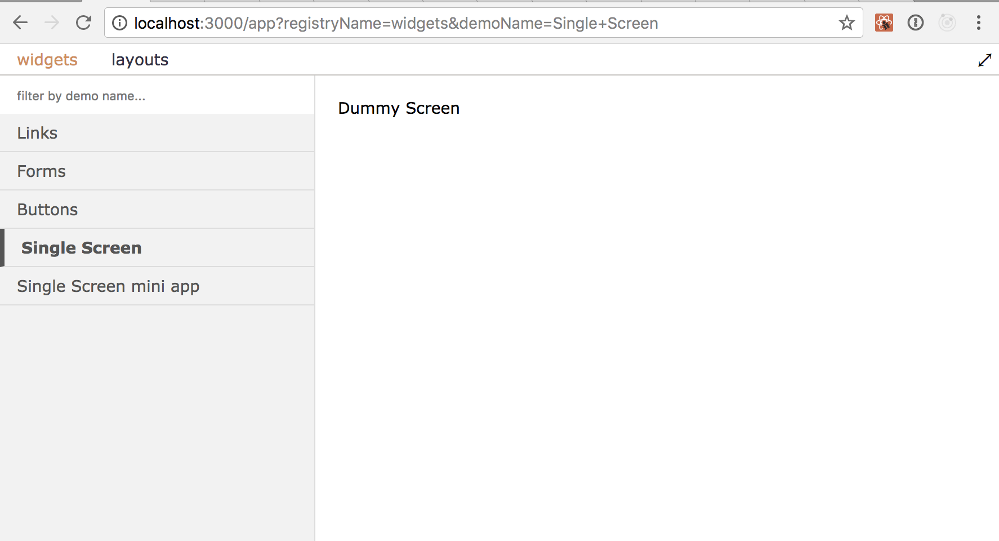

# Installation

```
npm install react-component-viewer --save-dev 
```

# React Components Viewer

Is a React component to preview and develop your components.
Use it in your CRA created app as a demo app.

```typescript 
import * as React from 'react';

import { Registry, ComponentsViewer } from 'react-components-viewer';

import { buttonsDemo } from './demos/buttons';
import { linksDemo } from './demos/links';
import { profileScreenDemo } from './demos/profileScreen';
import { formsDemo } from './demos/forms';
import { sideBySideDemo } from './demos/sideBySide';

const widgets = new Registry('widgets');
widgets
    .registerAsGrid('Links', 300, linksDemo)
    .registerAsTwoColumnTable('Forms', formsDemo)
    .registerAsTwoColumnTable('Buttons', buttonsDemo)
    .registerSingle('Single Screen', profileScreenDemo)
    .registerAsMiniApp('Single Screen mini app', '/app', profileScreenDemo);

const layouts = new Registry('layouts');
layouts
    .registerSingle('Side by Side', sideBySideDemo);

export function App() {
    return (
        <ComponentsViewer registries={[widgets, layouts]}/>
    );
}
```

It will work with your build system, the language of your choice and style processing.



# Demo functions

Demo must be defined in a function that accepts `Registry`. Function should register components to display.

```typescript
export function buttonsDemo(registry: Registry) {
    registry
        .add('enabled', () => <Button label="click me" onClick={onClick}/>,
             `long description
             multiline markdown`)
        .add('disabled', () => <Button label="click me" enabled={false} onClick={onClick}/>)
}
``` 

# Registration methods

`registerAsGrid` name, minWidth, demoFunction

`registerAsRows` name, demoFunction

`registerAsTwoColumnTable` name, demoFunction

`registerAsTabs` name, demoFunction

`registerAsSingle` name, demoFunction

